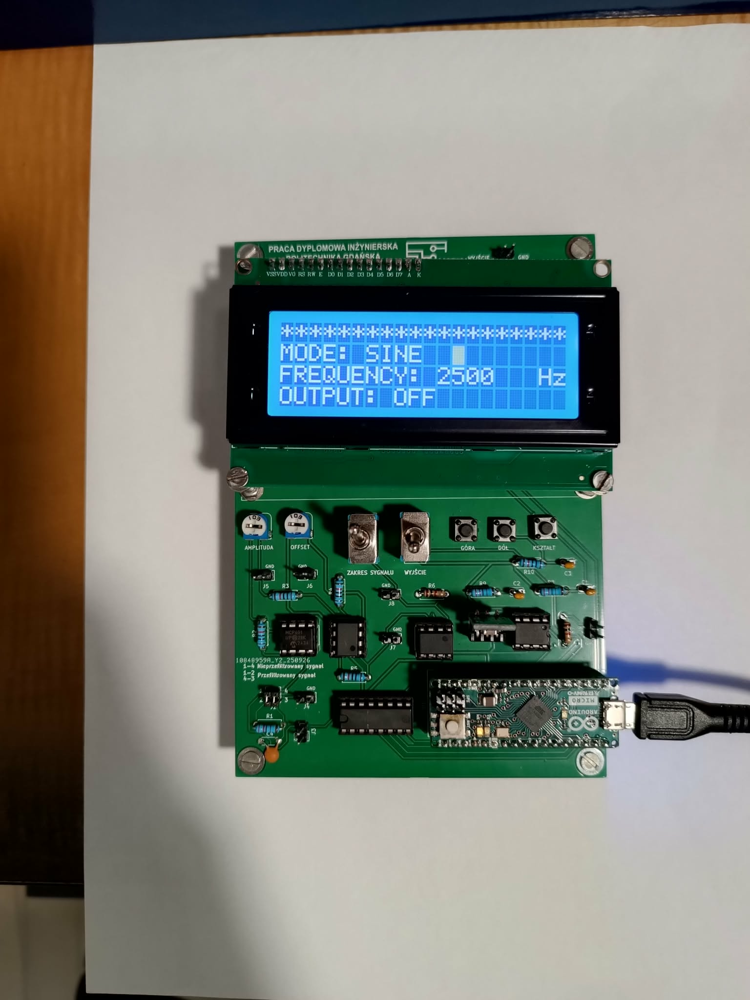
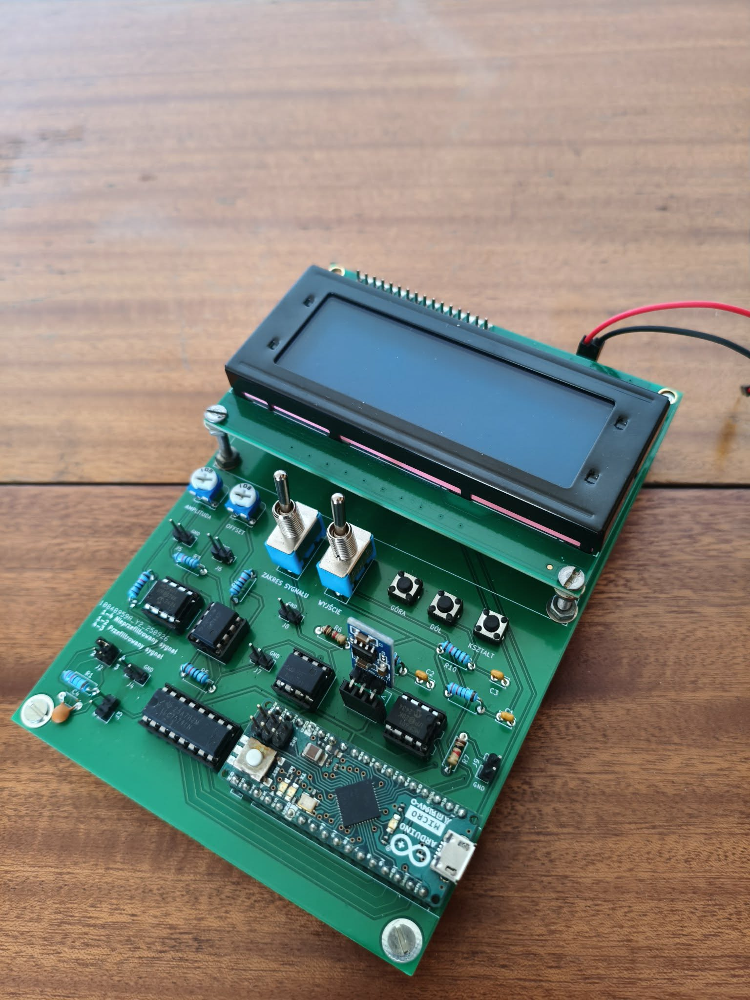
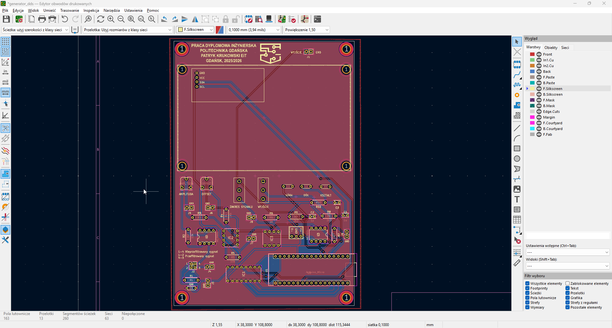
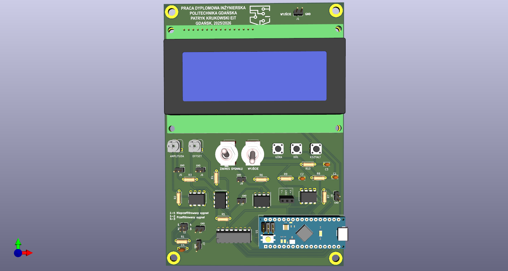

# DDS_generator_ATmega32u4

Projekt generatora przebiegów okresowych opartego na bezpośredniej syntezie cyfrowej. Układ bazuje na mikrokontrolerze ATmega32u4 i przetworniku C/A TLC7524C. Oprogramowanie zostało napisane w języku C bazując na rejestrach mikrokontrolera. Projekt płytki PCB został wykonany w programie KiCad. 

